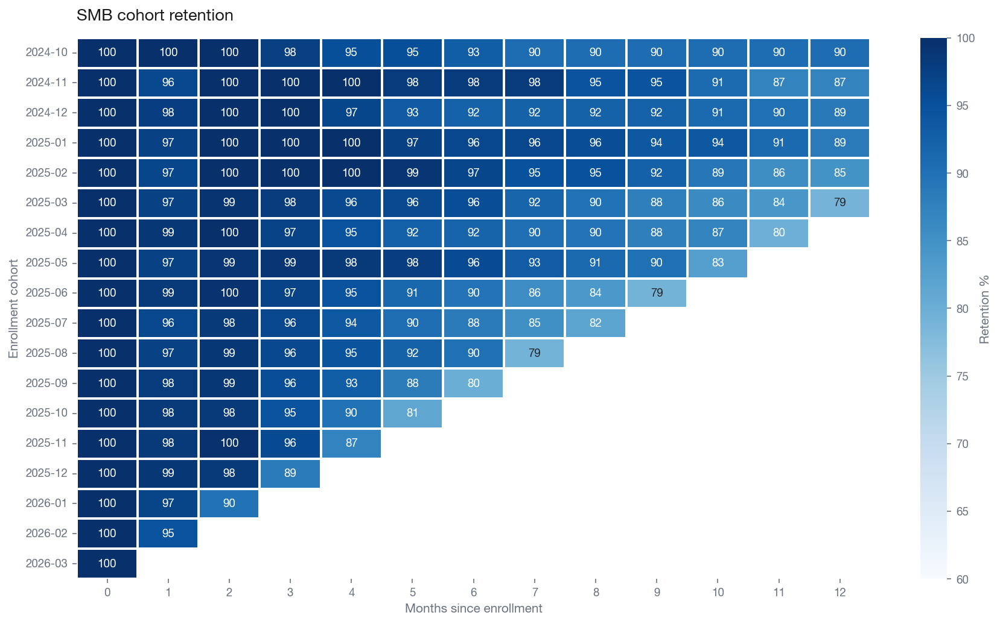
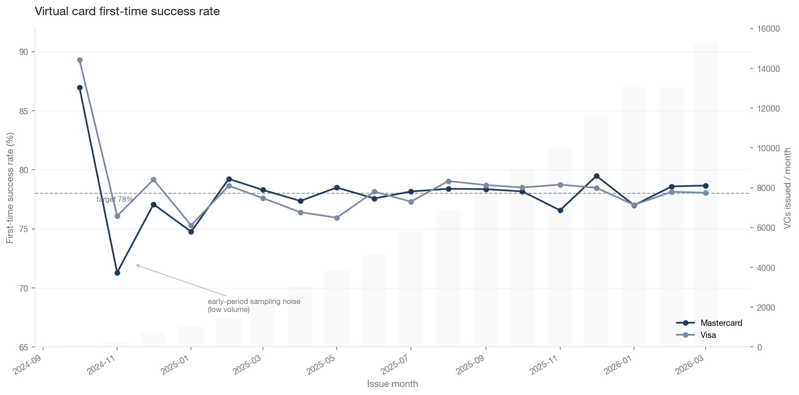
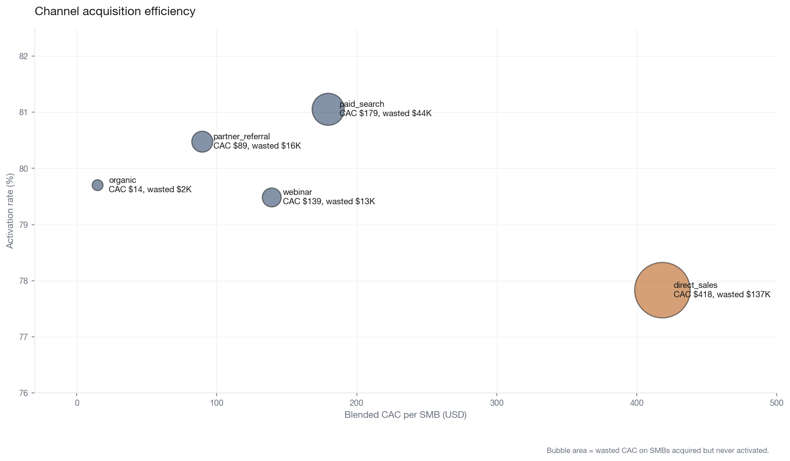
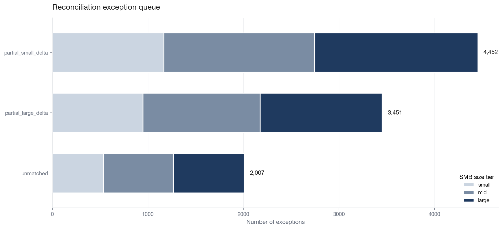

# BillGO Exchange Analytics — Reference Implementation

A reference analytics engineering project: four marts over a 351,270-row
synthetic payments event stream, with pytest-based data quality tests that
catch two deliberately-planted bugs before they reach production reporting.

## TL;DR

- **Four marts** on synthetic BillGO Exchange data: cohort retention, virtual
  card lifecycle, channel unit economics, reconciliation exceptions.
- **Two planted data quality bugs** (interchange fee decimal scale, orphan
  virtual cards) caught by automated tests, fixed with transactional SQL
  cleanup, rebuilt clean.
- **Three real findings** the dashboard surfaces: direct_sales wastes 80× the
  CAC of organic, recent cohort 3-month retention is degrading, and large
  SMBs generate disproportionate reconciliation risk.

## Dashboard

See [`docs/dashboard.html`](docs/dashboard.html) for the interactive reference
dashboard. Static preview:






## Architecture

```
raw tables  →  staging views  →  dimensions + facts  →  marts
 (6 tables)     (6 views)        (dim_date,              (cohort retention,
                                  dim_smb,                VC lifecycle,
                                  fct_invoices,           channel unit econ,
                                  fct_payment_lifecycle)  reconciliation
                                                          exceptions)
```

Classic Kimball-style star schema, implemented as PostgreSQL views and
tables. Portable to Snowflake + Coalesce — transformation logic is in plain
SQL, not platform-specific features.

## Marts

| Mart | Business question | BillGO hiring priority it informs |
|---|---|---|
| `mart_smb_cohort_retention` | Of SMBs enrolled in month X, how many still transact N months later? | Director of Product — Customer Management |
| `mart_virtual_card_lifecycle` | What % of VCs succeed first-try? Reissue rate by industry? | Director of Fraud Strategy; AI/ML baseline data |
| `mart_channel_unit_economics` | Which acquisition channels pay back? LTV/CAC by channel? | Director of Product — Customer Acquisition |
| `mart_reconciliation_exceptions` | Which captured invoices haven't reconciled cleanly? | Finance Ops |

## Data quality

Two realistic bugs were planted in the synthetic data generator and caught
by the pytest suite before any mart rebuilt on top of them:

1. **Decimal scale bug** — 0.5% of captured events (499 rows) wrote
   `interchange_fee` in basis points instead of dollars (e.g. $134,455 fee
   on a $50K capture). Caught by assertion `fee / amount < 10%`.

2. **Orphan VC bug** — 0.2% of virtual cards (197 rows) had authorization
   events but no upstream `vc_issued` event, corrupting time-to-capture
   analytics. Caught by existence assertion.

Both caught by `pytest tests/` — 15 tests total, 11 generic DQ checks plus
4 bug-specific assertions. Detect → diagnose → fix cycle is documented with
text artifacts in [`docs/test_outputs/`](docs/test_outputs).

The fix ran as a transactional SQL cleanup
([`sql/ddl/10_fix_planted_bugs.sql`](sql/ddl/10_fix_planted_bugs.sql)) with
explicit BEGIN/COMMIT, row-count notices, and an `evt_fix_*` naming
convention on synthesized events so auditors can distinguish corrections
from original data.

## Key findings

See [`docs/findings.md`](docs/findings.md) for the full write-up. Headlines:

- **Direct sales wastes ~$138K CAC on never-activated SMBs** — 80× the waste
  of organic — despite comparable activation rates. Primary candidate for
  channel rebalance under a COGS reduction mandate.
- **3-month retention degrades as acquisition scales**: Oct 2024 cohort at
  97.6%, Dec 2025 cohort at 88.6%. Hypothesis: channel mix drift or
  onboarding capacity lag.
- **Large SMBs generate the majority of dollar-weighted reconciliation
  risk** despite being 10% of the base — supports a tiered Ops SLA.

## Known simplifications

Synthetic data trades some realism for transparency. Named explicitly so
the interview conversation can go straight to the model, not the data:

- Churn rate (~8% across 18 months) is gentler than real-world SMB payments
  retention (typically 25–40% annual).
- LTV uses a 24-month linear extrapolation with a 2× cap. Production would
  use survival analysis; this is a defensible placeholder.
- Card network is assigned deterministically from a hash of
  `virtual_card_id`. Production would read from the issuance event.
- CAC values are coarse channel-level estimates, not campaign-level. The
  shape of the bubble chart is the signal, not the absolute dollars.
- Reconciliation age threshold (96h) was tuned to the generator's 12–72h
  delay distribution; production would set this from actual SLA data.

## Tech stack

PostgreSQL 16 (dev), Snowflake (target), Coalesce (transformation pattern),
Tableau-ready marts, Python 3.14 (generator + tests), pytest (DQ suite),
matplotlib + seaborn (charts).

## Run locally

Requires: Python 3.10+, PostgreSQL 16, pip.

```bash
# Setup
createdb billgo_analytics
python3 -m venv venv && source venv/bin/activate
pip install -r requirements.txt

# Build raw schema and populate
psql billgo_analytics -f sql/ddl/01_create_raw_tables.sql
python -m generator.generate_smbs
python -m generator.generate_events
python -m generator.generate_reconciliations

# Detect planted bugs
pytest tests/ -v

# Apply the fix and rebuild downstream
psql billgo_analytics -f sql/ddl/10_fix_planted_bugs.sql
for f in sql/ddl/0[2-9]_*.sql; do psql billgo_analytics -f $f; done

# Re-run tests — all 15 green
pytest tests/ -v

# Regenerate charts
python -m dashboards.chart_01_cohort_retention
python -m dashboards.chart_02_vc_success_trend
python -m dashboards.chart_03_channel_economics
python -m dashboards.chart_04_reconciliation_exceptions

# Open the dashboard
open docs/dashboard.html
```

## Author

Vedavyas Muddati — Data Analytics Engineer at Palette Labs / Nosh.
[LinkedIn](https://linkedin.com/in/vedavyas-muddati)

---

*All data in this project is synthetic. Not affiliated with BillGO, Inc.
Patterns illustrate the analytical model, not BillGO's actual performance.*
